# Procedure for Generating and Validating VNA Set Files for use with trace-history tool

## Create Setup

### Sweep Settings

Push `PRESET`

Push `START` and enter the start frequency.

Push `STOP` and enter the stop frequency.

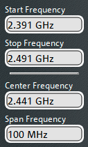

Push `SWEEP` and set the number of points.

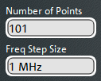

On the same tab, set `Freq Sweep Mode` to either `Stepped` (default) or `Swept` (faster).

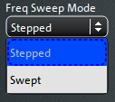

Push `POWER BW AVG` and set the power level.

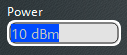

Push `POWER BW AVG` again to select the `Bandwidth` tab, then set the IF Bandwidth.

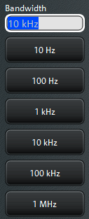

Push `CHANNEL CONFIG`, then select the `Mode` tab. At the bottom, manually set `AGC Mode` as appropriate (`Auto` setting requires pre-measurement and adjustment, and is therefore slowest).

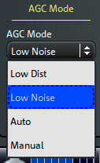

### Traces

Push `TRACE CONFIG`, then press `Add Tr+Diag` three times

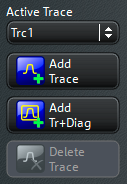

Select diagram area 1 with the mouse, then push `MEAS` and set the S-Parameter to `S12`.

Select diagram area 2 with the mouse, then set the S-Parameter to `S13`.

Select diagram area 3 with the mouse, then set the S-Parameter to `S42`.

Select diagram area 4, then set the S-Parameter to `S43`.

## Calibration

### Swept Mode

Note that with swept mode the calibration settings (start frequency, stop frequency, points, bandwidth, etc) must exactly match for the calibration to be valid!

### Step Mode

In step mode, you have the option of calibrating a wider frequency range and/or using a more precise bandwidth.

In particular, I would recommend setting a narrower bandwidth than the one you are using for measurement to further ensure that any noise introduced as part of calibration is negligible during measurement.

### Performing Calibration

There are some system calibration settings that we need to verify before we get started.

Push `SETUP`, then click `System Config...`.

In the `System Config` window, navigate to the `Calibration` tab.

Make sure the following settings are enabled:

- `Auto Power Reduction for Cal Unit`
- `Multiple Cal in Calibration Wizard`

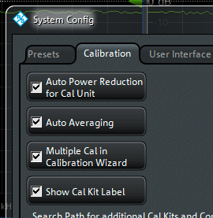

To start calibration, push `CAL`, then click `Start... (Cal Unit)`. If this button is disabled confirm that your Cal Unit is connected via USB and try again.

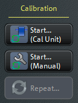

In the `Calibration Unit` window, click the `Add...` button to add a calibration.

In the `Define Calibration` window do the following:

- Select ports P1, P2, P3, and P4
- Change the Characterization to `20191004-bt-lei-li`
- Change the `Calibration Type` to `One Path Two Ports`
- Set `Source` to `Port 2`

Click `OK`.

Then in the `Calibration Unit` window again click `Add...` and enter the following in the `Define Calibration` window:

- Select ports P1, P2, P3, and P4
- Change the Characterization to `20191004-bt-lei-li`
- Change the `Calibration Type` to `One Path Two Ports`
- Set `Source` to `Port 3`

These settings are the same with the exception of the `Source` port (`Port 3`).

Click `OK` to create the second calibration.

The resulting window should look like this:

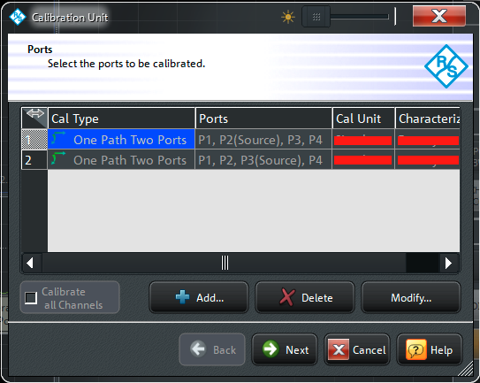

Click `Next`.

For each calibration, click the calibration and then click `Default Port Assignment`.

Click `Start`.

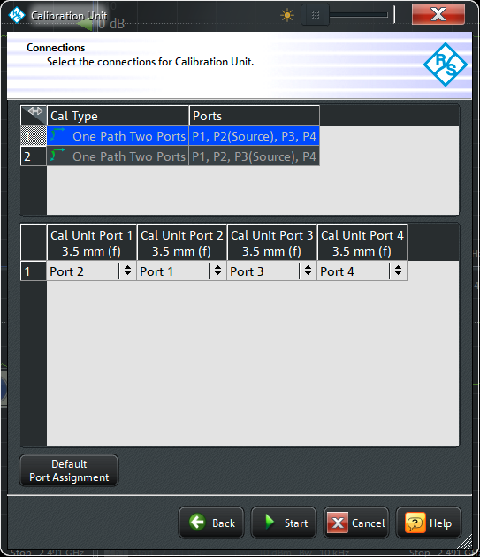

Follow and perform the steps on screen to complete the calibration.

I recommend using the `Detect Port Assignment` and `Detect Port Assignment and Start Cal` buttons. They help by confirming the RF connections, preventing you from embedding user error into the cal.

If using a two port cal unit, the total number of steps to perform will be six.

When you are finished performing all the steps, click `Apply`.

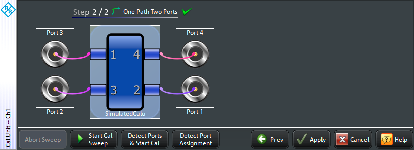

## Saving a Calibration

Push `CAL`, then select the `Use Cal` tab.

Click `Cal Manager...`.

In the `Cal Manager` window, select the channel (Ch1) then click `Add`. You should now see the saved cal in the cal `Pool` on the right. It initially has a name such as `Cal Group 1`; the calibration can be renamed.

## Applying a Calibration

You can apply a saved calibration in a similar manner to saving it.

Push `CAL`, navigate to the `Use Cal` tab then click `Cal Manager...`.

In the `Cal Manager` window, select the channel to apply the calibration to from the list on the left. Then, select the calibration from the cal `Pool` on the right.

Click `Apply`.

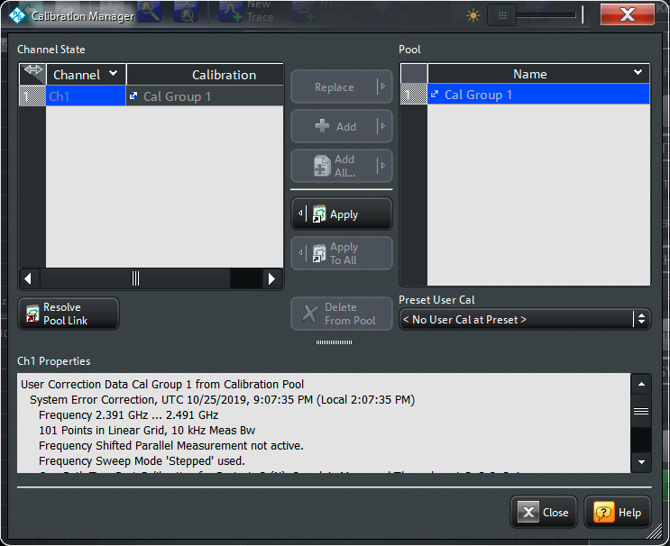

It is recommended that you also click `Resolve Pool Link`, as this (confusing auto-save) feature is not needed.

## Saving a Setup

To save a setup as a set file (with a `.znx` extension):

Push `FILE`, then click the `Save...` button to save the set file.

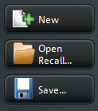

The default location for set files is:

`C:\Users\Instrument\Documents\Rohde-Schwarz\Vna\RecallSets\`

## To Recall a Setup

To open a setup (`.znx` set file):

Push `FILE`, then click the `Open Recall...` button. In the `Recall` dialog window, select the set file to recall. Click `Open`.

Each open set file is displayed as a tab at the top of the display. The tab is hidden when only one exists.
