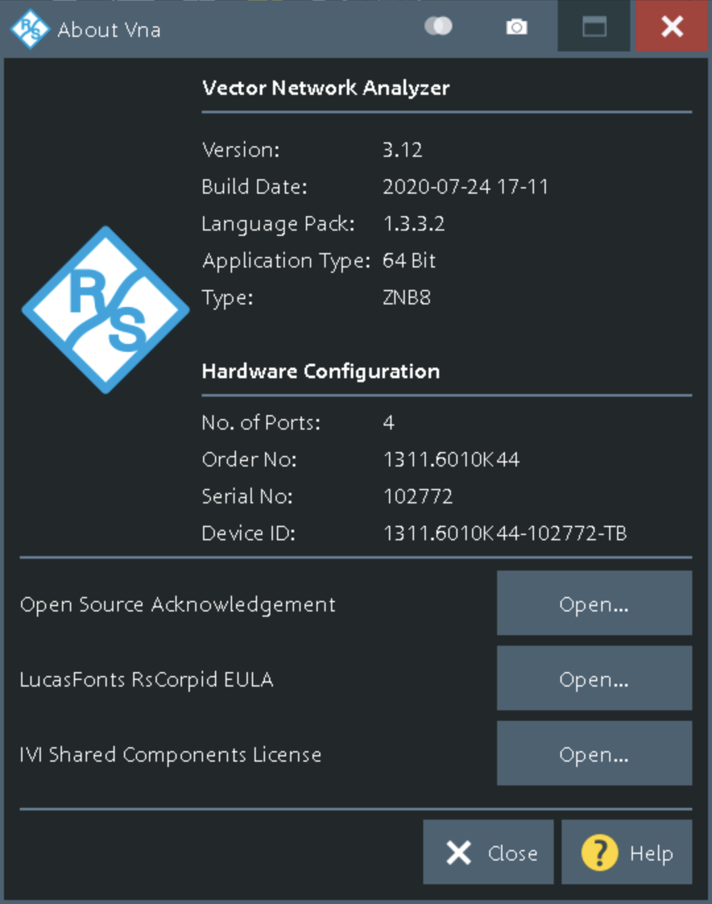
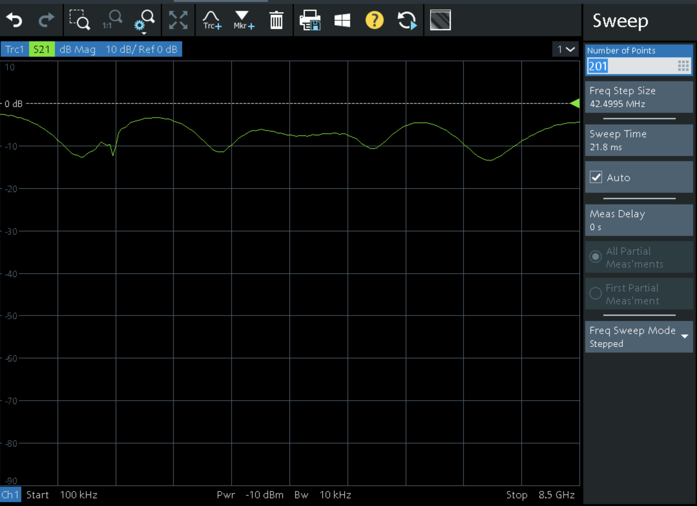
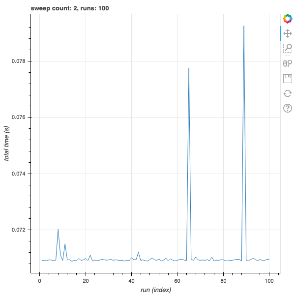
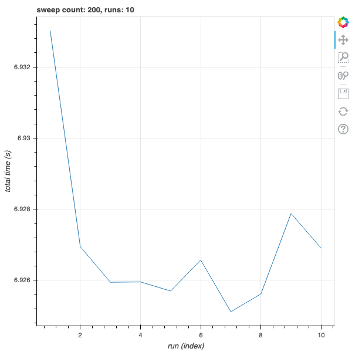
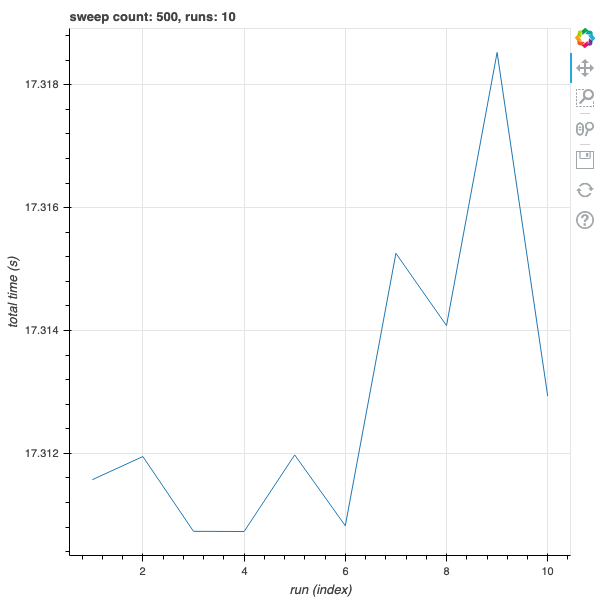
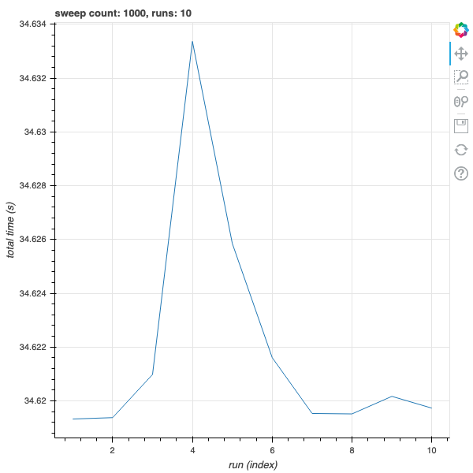
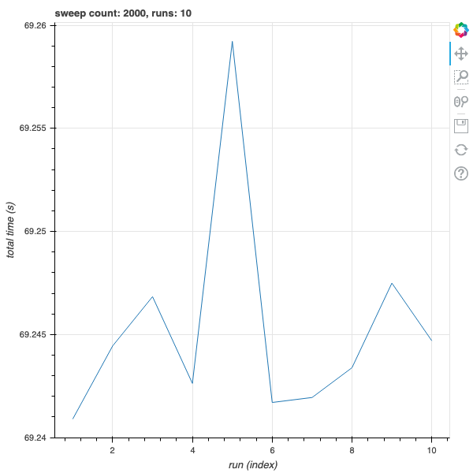

# Sweep Time Validation

Generate statistics for estimated sweep time with various `sweep_count`.

## Instrument

The instrument details are displayed below:

## Preset Settings

The preset settings are displayed below:

## Total Time (Measured)

## Total Time Statistics

| Sweep Count | Runs | Min (ms)  | Mean (ms) | Max (ms)  |
| ----------- | ---- | --------- | --------- | --------- |
| 2           | 100  | `0.0709`  | `0.0711`  | `0.0793`  |
| 200         | 10   | `6.9251`  | `6.9270`  | `6.9330`  |
| 500         | 10   | `17.3107` | `17.3129` | `17.3185` |
| 1000        | 10   | `34.6193` | `34.6219` | `34.6334` |
| 2000        | 10   | `69.2592` | `69.2453` | `69.2592` |

## Estimated Sweep Time Statistics

| Sweep Count | Runs | Min (ms) | Mean (ms) | Max (ms) |
| ----------- | ---- | -------- | --------- | -------- |
| 2           | 100  | `35.4`   | `35.6`    | `39.6`   |
| 200         | 10   | `34.6`   | `34.6`    | `34.7`   |
| 500         | 10   | `34.6`   | `34.6`    | `34.6`   |
| 1000        | 10   | `34.6`   | `34.6`    | `34.6`   |
| 2000        | 10   | `34.6`   | `34.6`    | `34.6`   |

As you can see, the transient time per sweep (which appears to peak at 5-6 seconds in extreme conditions) is almost gone at `sweep_count=200`.
